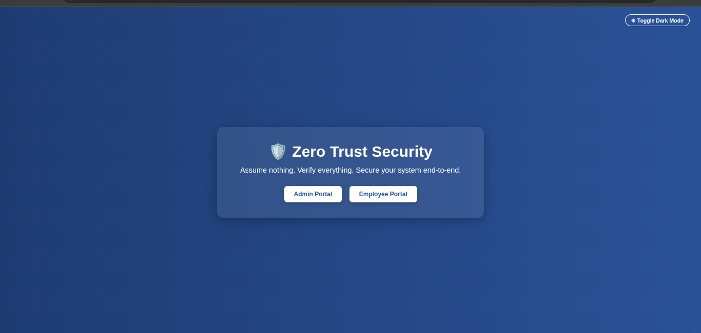
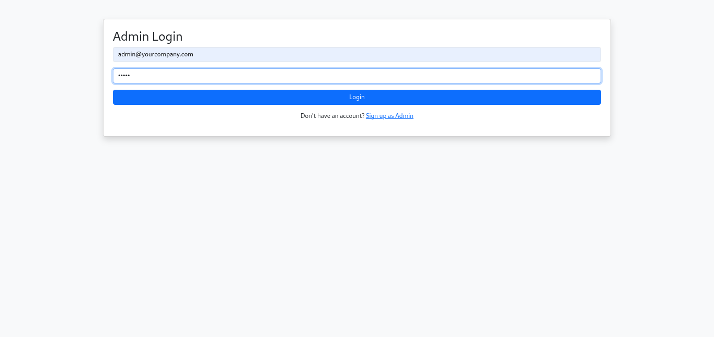
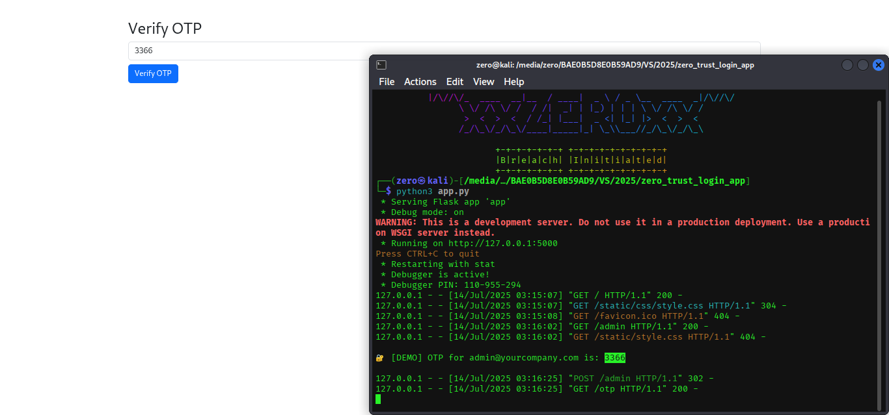
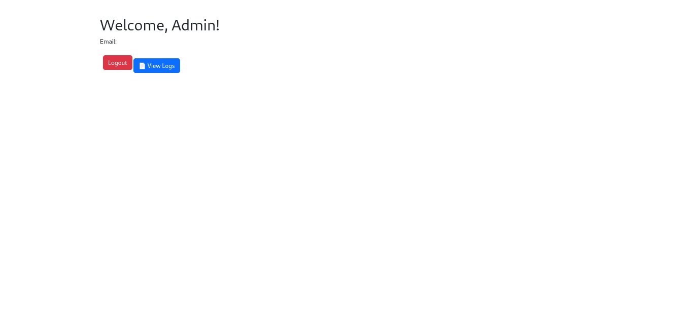
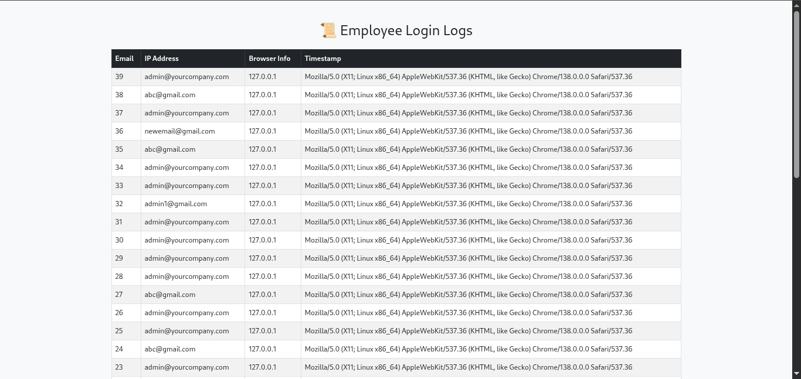
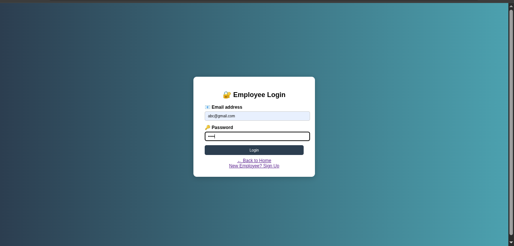
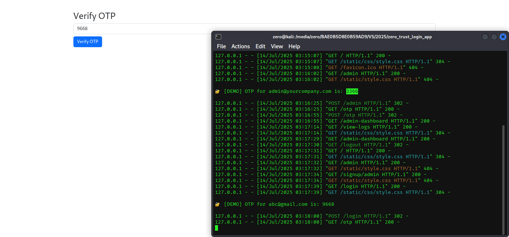
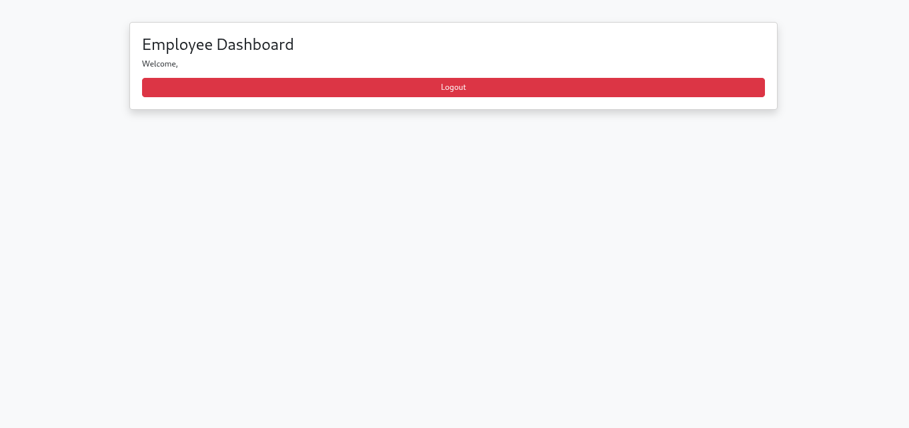
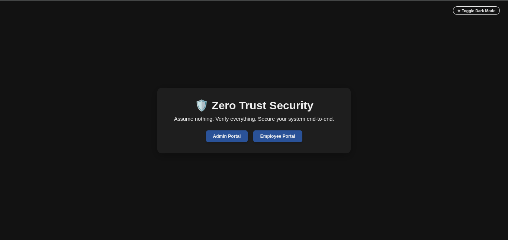

# 🛡️ Zero Trust Login System

A modern, secure, and professional **Zero Trust Login System** built with Flask.  
This system features **role-based access**, **OTP-based email verification**, detailed **logging of user activity**, and a clean user interface with dark mode support.

> ⚠️ Zero Trust Model: *Assume nothing. Verify everything.*

---

## ✨ Features

- 🧑‍💼 Admin and Employee Role Separation
- 🔐 OTP-based Email Verification (for both Admin & Employee)
- 📜 Log Tracking with IP, Browser, Timestamp
- 🖥️ System Info Logging
- 📂 SQLite3 Database Integration
- 🌓 Dark Mode Toggle
- 📍 Clean and Responsive UI
- ⚙️ Easily Extendable

---

## 📸 Screenshots

### 🏠 Home Page


---

### 👨‍💼 Admin Panel
#### Admin Login


#### Admin OTP Verification


#### Welcome Admin Dashboard


#### Admin View Logs


---

### 👷‍♂️ Employee Portal
#### Employee Login


#### Employee OTP Verification


#### Employee Dashboard


---

### 🌗 Dark Mode


---

## 📦 Technologies Used

- Python 3
- Flask
- SQLite3
- HTML, CSS, JavaScript
- Bootstrap
- smtplib (for email)

---

## 🚀 Run the Project Locally

### 1. Clone the Repository
```bash
git clone https://github.com/talhatariq708/Zero-Trust-Login-System.git
cd Zero-Trust-Login-System

------------------------


python3 -m venv venv
source venv/bin/activate  # Linux/macOS
venv\Scripts\activate     # Windows

pip install -r requirements.txt

python app.py


-------------------------

| Admin Role Features | Employee Role Features |
| ------------------- | ---------------------- |
| View logs           | Dashboard only         |
| Access control      | Limited access         |
| Admin signup/login  | Employee signup/login  |

-------------------------

📜 License

MIT License © 2025 Talha Tariq

💬 Disclaimer

This is a demo project built for learning and portfolio purposes only.
It is not production-ready without further security measures.
👨‍💻 Author

Built with ❤️ by Talha Tariq
🔗 GitHub: @talhatariq708
📩 Open for collaboration and feedback!

🔖 Disclaimer

This project is for educational/demo purposes only.
It is not yet production-ready — full security features are in progress.