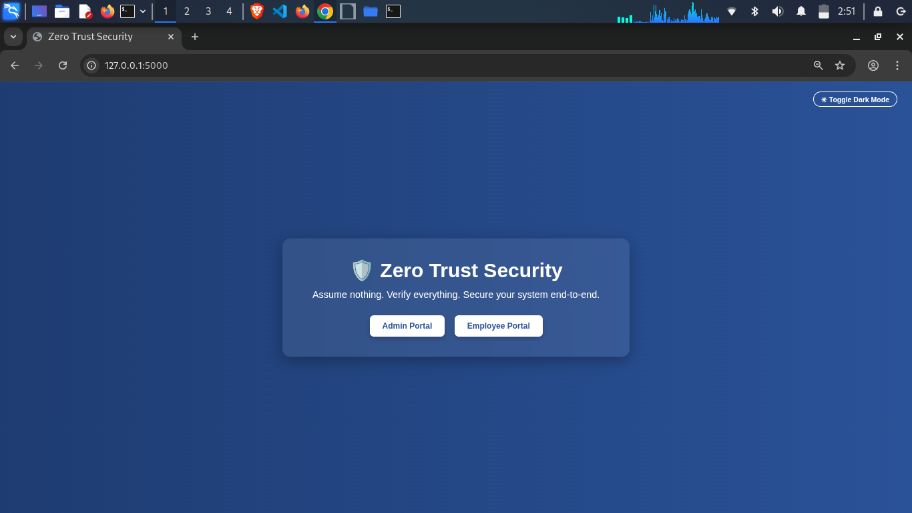
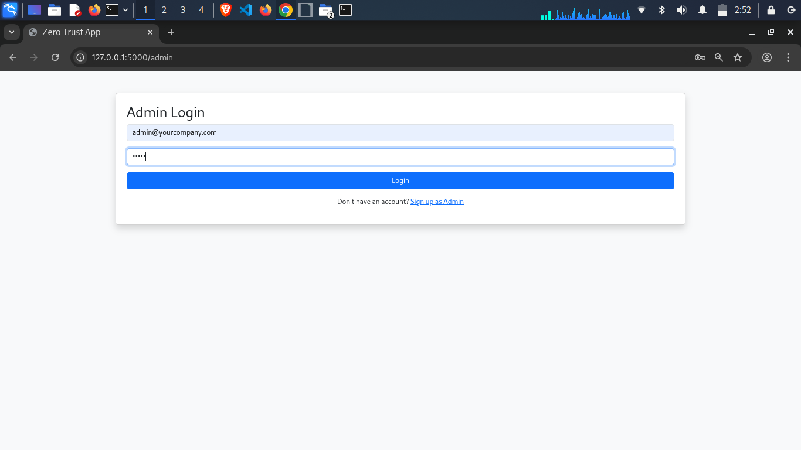
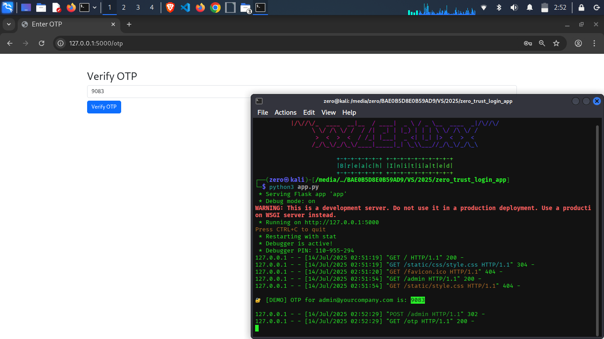
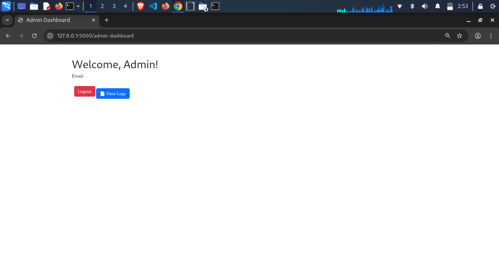
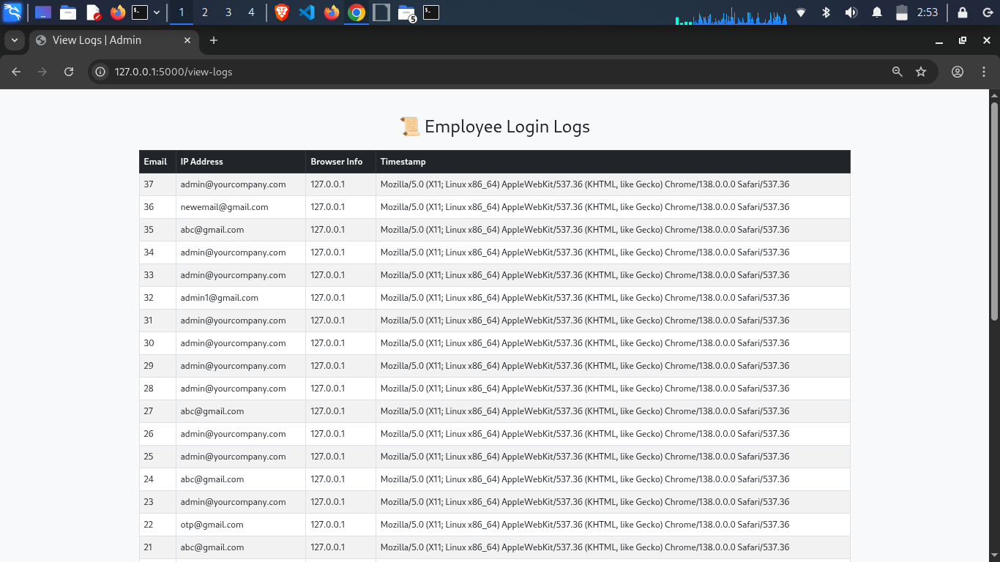
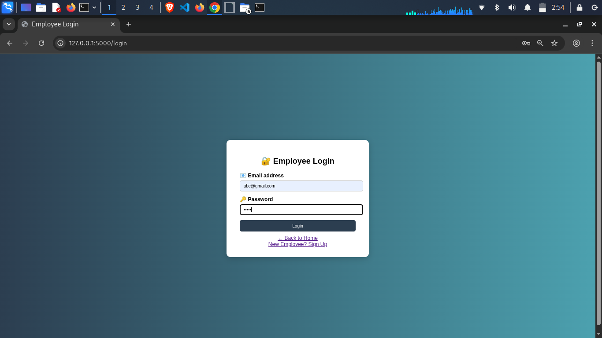
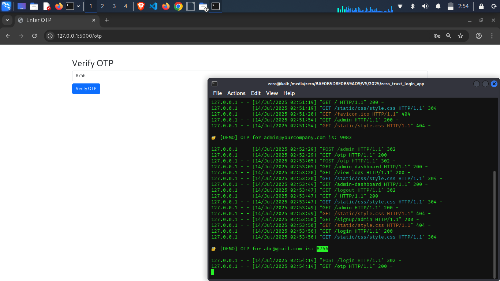
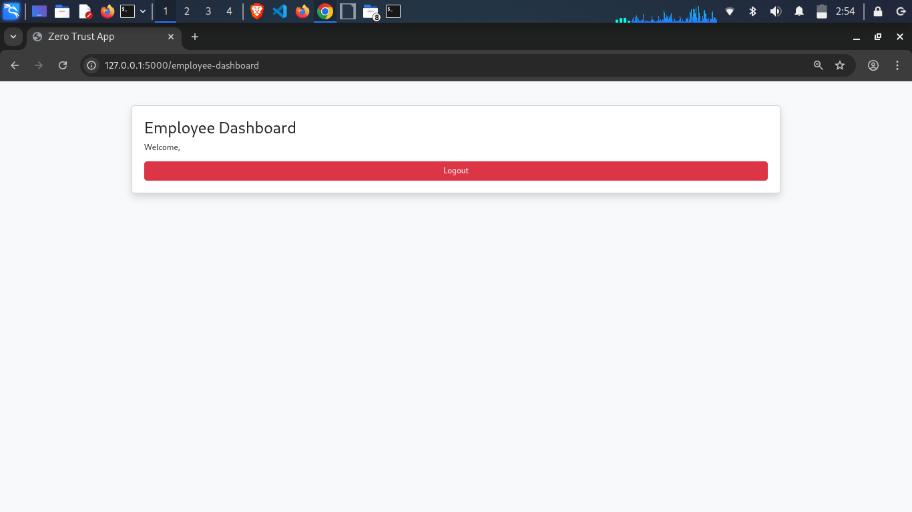

# 🔐 Zero Trust Login System

A modern, role-based secure login system built using **Flask**, inspired by the Zero Trust Security model.

> "Assume nothing. Verify everything."

---

## 🚀 Key Features

- 🔐 Zero Trust-style email-based **OTP authentication**
- 🧑‍💼 Separate **Admin** and **Employee** login/signup flows
- ✉️ Email verification via OTP
- 📊 Activity logs with IP, browser, and timestamp
- 🌙 Dark mode toggle with animation
- ❗ Error handling for invalid OTP, duplicate user, etc.
- 🧠 Clean, responsive, animated UI
- 🔄 Session-based redirection for role-based dashboards

---

## 📸 Screenshots

| Home Page | Employee Login | Employee Signup |
|-----------|----------------|-----------------|
|  |  |  |

| OTP Page | Admin Dashboard | View Logs |
|----------|------------------|-----------|
|  |  |  |

| Dark Mode | Invalid OTP/Error |
|-----------|--------------------|
|  |  |

> ✅ _More UI improvements and features will be added soon!_

---

## ⚙️ Tech Stack

- **Backend**: Python, Flask
- **Frontend**: HTML5, CSS3, JavaScript (with animations)
- **Database**: SQLite
- **OTP**: Sent via smtplib (demo/local mode available)

---

## 🛠️ Getting Started

```bash
git clone https://github.com/talhatariq708/Zero-Trust-Login-System.git
cd Zero-Trust-Login-System
python3 -m venv venv
source venv/bin/activate   # On Windows: venv\Scripts\activate
pip install -r requirements.txt
python app.py

| Admin Role Features | Employee Role Features |
| ------------------- | ---------------------- |
| View logs           | Dashboard only         |
| Access control      | Limited access         |
| Admin signup/login  | Employee signup/login  |
